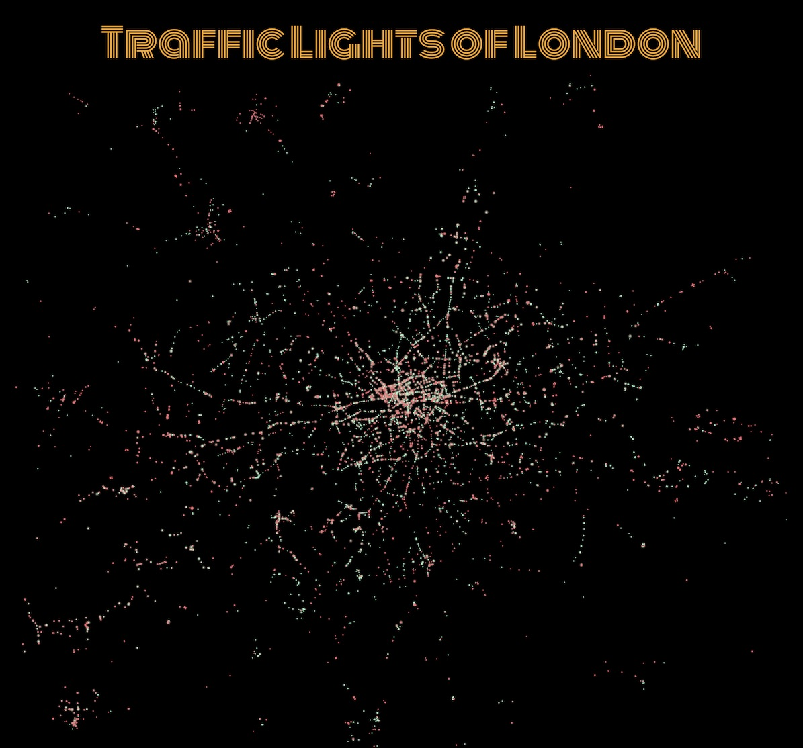

@import "css/litvis.less"

```elm {l=hidden}
import VegaLite exposing (..)
```

# 30 Day Map Challenge, Day 1: Points

_This document best viewed in [litvis](https://github.com/gicentre/litvis)_

## Initial Thoughts

I only have an hour or so to work on this so need dataset relatively easy to find and work with. OSM should have plenty of point features, and I already have a workflow for [mapping OSM with Vega-Lite](https://github.com/gicentre/litvis/blob/master/documents/tutorials/geoTutorials/openstreetmap.md).

Trees (interesting but coverage in OSM too unreliable)? Telephone boxes (not many left now; would be interesting to have seen them decline over time)? Traffic lights (could work and should reflect street pattern)?

Could create a disco-themed design reflecting traffic light colours. What would London look light at night if only illuminated by traffic lights and Balisha beacons?

## Data Preparation

1. [Open Street Map](https://www.openstreetmap.org/search?query=london#map=11/51.5077/-0.1274) with bounds `-0.1909,51.4744,-0.0249,51.5447` (central London)
2. Exported from OSM via Overpass API
3. Point features converted to geoJSON via `ogr2ogr -f GeoJSON pointMap.geojson map.osm points`
4. Imported into [Mapshaper]() and clipped in mapshaper console with `clip bbox=-0.1909,51.4744,-0.0249,51.5447`
5. Filtered for traffic signal features with `filter 'highway == "traffic_signals" || RegExp(".*traffic_signals.*").test(other_tags)'`
6. Only store 'highway' attribute: `filter-fields 'highway'`
7. Save as CSV file: `each 'longitude=this.x, latitude=this.y' -o 'trafficSignals.csv'`

## Initial map

Test to check the data are workable.

```elm {l v}
pointMap1 : Spec
pointMap1 =
    let
        data =
            dataFromUrl "data/centralLondonTrafficSignals.csv"

        enc =
            encoding
                << position Longitude [ pName "longitude", pMType Quantitative ]
                << position Latitude [ pName "latitude", pMType Quantitative ]

        proj =
            projection [ prType transverseMercator ]
    in
    toVegaLite [ width 400, height 300, data [], proj, enc [], circle [ maSize 4 ] ]
```

## Larger Region

As above but for the whole London region (from Guildford in SW to Ingatestone and Harlow in NE). Clipping region `-0.6606,51.2146,0.3886,51.7882`

- Colour lights by whether pedestrian crossings or vehicle traffic lights.
- Keep non-point content to minimum
- Design as if disco album cover
- Give each point a glow effect by overlaying a smaller point symbol over a larger translucent one.

```elm {l}
pointMap2 : Spec
pointMap2 =
    let
        cfg =
            configure
                << configuration (coView [ vicoStroke Nothing ])

        colours =
            categoricalDomainMap
                [ ( "traffic_signals", "rgb(245,112,121)" )
                , ( "traffic_signals;crossing", "rgb(168,203,201)" )
                , ( "crossing", "rgb(168,243,201)" )
                , ( "crossing;traffic_signals", "rgb(168,243,201)" )
                ]

        data =
            dataFromUrl "data/londonRegionTrafficSignals.csv"

        trans =
            transform
                << filter (fiExpr "datum.highway != 'give_way' && datum.highway != ''")

        enc =
            encoding
                << position Longitude [ pName "longitude", pMType Quantitative ]
                << position Latitude [ pName "latitude", pMType Quantitative ]
                << color [ mName "highway", mMType Nominal, mScale colours, mLegend [] ]

        proj =
            projection [ prType transverseMercator ]

        glowSpec =
            asSpec [ circle [ maSize 24, maOpacity 0.06 ] ]

        pointSpec =
            asSpec [ circle [ maSize 4, maStrokeOpacity 0, maOpacity 0.8 ] ]
    in
    toVegaLite
        [ cfg []
        , background "black"
        , padding (paEdges 0 40 0 0)
        , title "Traffic Lights of London" [ tiOffset 10, tiColor "#ffa908", tiFont "Monoton", tiFontWeight Normal, tiFontSize 60 ]
        , width 1200
        , height 1000
        , data []
        , trans []
        , proj
        , enc []
        , layer [ glowSpec, pointSpec ]
        ]
```


