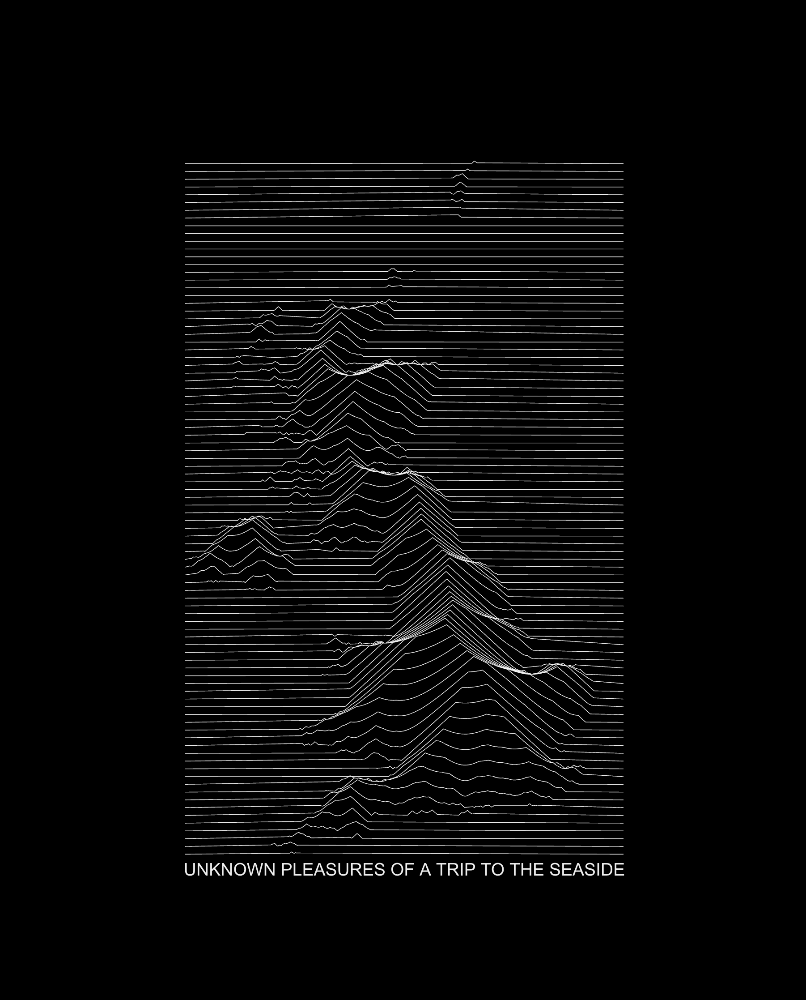

@import "css/litvis.less"

# 30 Day Map Challenge, Day 2: Lines

_This document best viewed in [litvis](https://github.com/gicentre/litvis)_

## Initial Thoughts

Peter Saville's [Unknown Pleasures design](https://blogs.scientificamerican.com/sa-visual/pop-culture-pulsar-origin-story-of-joy-division-s-unknown-pleasures-album-cover-video/). Iconic use of lines. But what to show and how would it be a map? Britain has approximately similar aspect ratio. Could show distance from coastline as this will increase towards centre.

Unknown pleasures of the seaside?

How best to calculate distance? Does not have to be accurate at this scale so could just treat boundary vertices as points. No need to calculate distances within line segments.

## Data File Preparation

1. Use [ukConstituencies.json](https://github.com/gicentre/data/blob/master/uk/ukConstituencies.json), which itself was based on [ONS boundary data](https://geoportal.statistics.gov.uk/datasets/european-electoral-regions-december-2016-full-clipped-boundaries-in-great-britain) simplified in [mapshaper](https://mapshaper.org).

2. Create a coastline file with mapshaper by dissolving internal polygon boundaries and reprojecting to OSGB National Grid coordinates:

```
mapshaper ukConstituencies.json -dissolve2 name=coastline \
 -proj +init=EPSG:27700 \
 -o format=topojson ukCoastline.json
```

3. Create a coastal vertex file from `ukCoastline.json`:

```
mapshaper ukCoastline.json -points vertices \
 -o precision=0.1 format=geojson ukCoastVertices.json
```

4. Create a grid of 1000x90 points over entire region with mapshaper

```
mapshaper ukCoastline.json -point-grid 1000,90 \
 -o precision=0.00001 format=geojson ukGrid.json
```

5. Filter grid to create a second grid of points only within land polygons:

```
mapshaper ukGrid.json -clip ukCoastline.json \
 -o format=geojson ukLandGrid.json
```

6. Extract coordinates from `ukCoastVertices.json` and `ukLandGrid.json` and place in [d02Data.md])(d02Data.md). Add missing rows to ukLandGrid.json (where no land in transact. Missing rows at the following northings: 983918, 1037568, 1050981, 1064394, 1077806, 1091219, 1104631.

## Data Check

Coastal vertices:

```elm {l v}
coastMap : Spec
coastMap =
    let
        data =
            dataFromColumns []
                << dataColumn "easting" (List.map Tuple.first coastalVertices |> nums)
                << dataColumn "northing" (List.map Tuple.second coastalVertices |> nums)

        enc =
            encoding
                << position X [ pName "easting", pQuant ]
                << position Y [ pName "northing", pQuant ]
    in
    toVegaLite [ width 200, height 400, data [], enc [], circle [ maSize 4 ] ]
```

Each row of points along an east-west line is referenced by its northing and contains a sequence of eastings.
Add a vertex at eastings of 0 and 700000 in order to use full width of line chart space.

```elm {l}
addToStrip : ( Float, Float ) -> Dict Float (List Float) -> Dict Float (List Float)
addToStrip ( easting, northing ) dict =
    if Dict.member northing dict then
        Dict.update northing
            (\maybeEastings ->
                case maybeEastings of
                    Nothing ->
                        Just [ easting ]

                    Just eastings ->
                        Just (eastings ++ [ easting ])
            )
            dict

    else
        Dict.insert northing [ easting ] dict


strips : List ( Float, List Float )
strips =
    List.foldl addToStrip Dict.empty gridPointsLand
        |> Dict.toList


toPairs : ( Float, List Float ) -> List ( Float, Float )
toPairs ( y, xs ) =
    [ ( 0, y ) ] ++ List.map (\x -> ( x, y )) xs ++ [ ( 700000, y ) ]
```

## Line Chart/Map

Add the distance to nearest coastal vertex to the northing of each grid point.

```elm {l=hidden}
gridMap : Spec
gridMap =
    let
        cfg =
            configure
                << configuration (coView [ vicoStroke Nothing ])

        points =
            List.concatMap toPairs strips

        sqDistToCoast ( x0, y0 ) =
            List.foldl (\( x1, y1 ) dMin -> min dMin ((x0 - x1) * (x0 - x1) + (y0 - y1) * (y0 - y1))) (10 ^ 50)

        pHeight ( easting, northing ) =
            if easting == 0 || easting == 700000 then
                northing

            else
                northing + sqrt (sqDistToCoast ( easting, northing ) coastalVertices)

        data =
            dataFromColumns []
                << dataColumn "row" (List.map Tuple.second points |> nums)
                << dataColumn "easting" (List.map Tuple.first points |> nums)
                << dataColumn "northing" (List.map pHeight points |> nums)

        enc =
            encoding
                << position X [ pName "easting", pQuant, pAxis [] ]
                << position Y [ pName "northing", pQuant, pAxis [] ]
                << detail [ dName "row", dNominal ]
    in
    toVegaLite
        [ cfg []
        , background "black"
        , title "UNKNOWN PLEASURES OF A TRIP TO THE SEASIDE"
            [ tiColor "#eee"
            , tiOrient siBottom
            , tiFontSize 27.9
            , tiFontWeight W400
            , tiOffset -5
            ]
        , padding (paSize 300)
        , width 700
        , height 1200
        , data []
        , enc []
        , line [ maStrokeWidth 1, maStroke "#f0f0f0" ]
        ]
```


