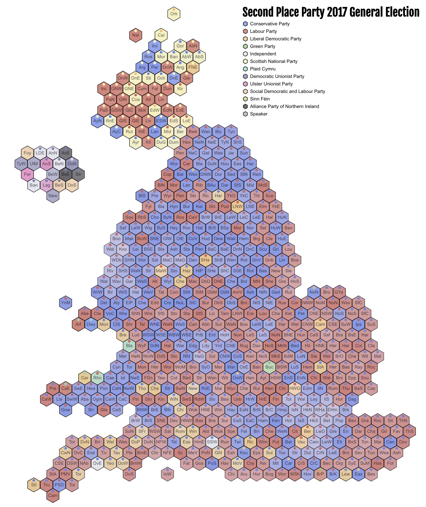

@import "css/litvis.less"

```elm {l=hidden}
import VegaLite exposing (..)
```

# 30 Day Map Challenge, Day 4: Hexagons

_This document best viewed in [litvis](https://github.com/gicentre/litvis)_

## Initial Thoughts

Voronoi diagram of (approximately) evenly distributed point set would provide an obvious hexagonal tessellation. Easy to produce in [Vega](https://github.com/gicentre/elm-vega#example), but less so in Vega-Lite. Could probably convert output to geojson so could render in Vega-Lite. Perhaps UK constituencies and some election map?

[Leeds ODI](https://odileeds.org/projects/hexmaps/constituencies/) have a hexagonal constituencies map that could be used. Uses a simple [hexjson format](https://odileeds.org/projects/hexmaps/hexjson).

[project linework](http://www.projectlinework.org) provides some hexagonal basemaps that could be used.

Or perhaps a more oblique reference to hexagons such as Benzene pollution?

## General Election 2017 Runners Up

Show a hex map of UK 2017 general election results, but showing second place party rather than winner. Overlay over winning party using opacity to reflect deficit. Close second place therefore shown in bolder colours.

Add a coloured dot to show winning party.

## Data Preparation

1. UK parliamentary constituency hex basemap from [ODI Leeds](https://odileeds.org/projects/hexmaps/constituencies).
2. Converted to CSV with [json-csv.com](https://json-csv.com) with manual editing of column names.
3. Added three-letter-abbreviation for each constituency name.
4. [Election results](https://researchbriefings.parliament.uk/ResearchBriefing/Summary/CBP-7979) used to extract winning and second party and the winning majority as `geResults2017.csv`.

Location of generated files:

```elm {l}
path : String -> String
path file =
    "https://gicentre.github.io/data/30dayMapChallenge/" ++ file
```

## Map Design

Vega-Lite doesn't have a direct voronoi transform so instead we use the centroids of each hex constituency and create a custom hex shape scaled as a proportion of the map width. To create a hex grid we need to offset every other row by half the hex width, which is easily achieved with a transform calculation.

```elm {l}
map1 : Spec
map1 =
    let
        w =
            950

        h =
            w * 6 / 5

        cfg =
            configure
                << configuration (coView [ vicoStroke Nothing ])
                << configuration
                    (coLegend
                        [ lecoOrient loTopRight
                        , lecoOffset (w / 30)
                        , lecoTitleFont "FjallaOne"
                        , lecoTitleFontSize (w / 40)
                        , lecoTitleLimit (w / 2)
                        , lecoLabelLimit (w / 4)
                        ]
                    )

        data =
            dataFromUrl (path "ukConstituenciesHex.csv")
                [ parse [ ( "hexRow", foNum ), ( "hexCol", foNum ) ] ]

        resultsData =
            dataFromUrl (path "geResults2017.csv") []

        colours =
            categoricalDomainMap
                [ ( "Conservative Party", "rgb(104,132,236)" )
                , ( "Labour Party", "rgb(209,101,92)" )
                , ( "Liberal Democratic Party", "rgb(238,190,117)" )
                , ( "Green Party", "rgb(132,200,125)" )
                , ( "Independent", "rgb(228,228,228)" )
                , ( "Scottish National Party", "rgb(247,242,180)" )
                , ( "Plaid Cymru", "rgb(141,217,190)" )
                , ( "Democratic Unionist Party", "rgb(126,125,176)" )
                , ( "Ulster Unionist Party", "rgb(226,125,188)" )
                , ( "Social Democratic and Labour Party", "rgb(240,200,160)" )
                , ( "Sinn Féin", "rgb(180,210,103)" )
                , ( "Alliance Party of Northern Ireland", "rgb(50,50,50)" )
                , ( "Speaker", "rgb(172,172,172)" )
                ]

        trans =
            transform
                << lookup "onsCode" resultsData "onsCode" (luFields [ "first", "second", "majority" ])
                << calculateAs "datum.hexRow%2==0 ? datum.hexCol-0.5 : datum.hexCol" "x"
                << calculateAs "datum.majority * -1" "deficit"

        hexPosition =
            encoding
                << position X [ pName "x", pQuant, pAxis [] ]
                << position Y [ pName "hexRow", pQuant, pAxis [] ]

        hexMark =
            [ maSize ((4 * w / 125) ^ 2)
            , maShape (symPath "m0 -1l0.866 0.5v1l-0.866 0.5l-0.866 -0.5v-1z")
            , maFilled True
            , maStroke "black"
            , maStrokeWidth (w / 900)
            ]

        firstEnc =
            hexPosition
                << color [ mName "first", mNominal, mScale colours, mLegend [] ]

        firstSpec =
            asSpec [ firstEnc [], point (maOpacity 0.2 :: hexMark) ]

        firstDotSpec =
            asSpec [ firstEnc [], circle [ maYOffset (-w / 100), maOpacity 1 ] ]

        secondEnc =
            hexPosition
                << color [ mName "second", mNominal, mScale colours, mLegend [ leTitle "Second Place Party 2017 General Election" ] ]
                << opacity [ mName "deficit", mQuant, mLegend [] ]

        secondSpec =
            asSpec [ secondEnc [], point hexMark ]

        labelEnc =
            hexPosition
                << text [ tName "label", tNominal ]
                << tooltips
                    [ [ tName "constituencyName", tNominal ]
                    , [ tName "first", tNominal ]
                    , [ tName "second", tNominal ]
                    , [ tName "majority", tQuant ]
                    ]

        labelSpec =
            asSpec [ labelEnc [], textMark [ maFontSize (w / 100), maOpacity 0.6 ] ]
    in
    toVegaLite
        [ cfg []
        , width w
        , height h
        , data
        , trans []
        , layer [ firstSpec, secondSpec, labelSpec, firstDotSpec ]
        ]
```


