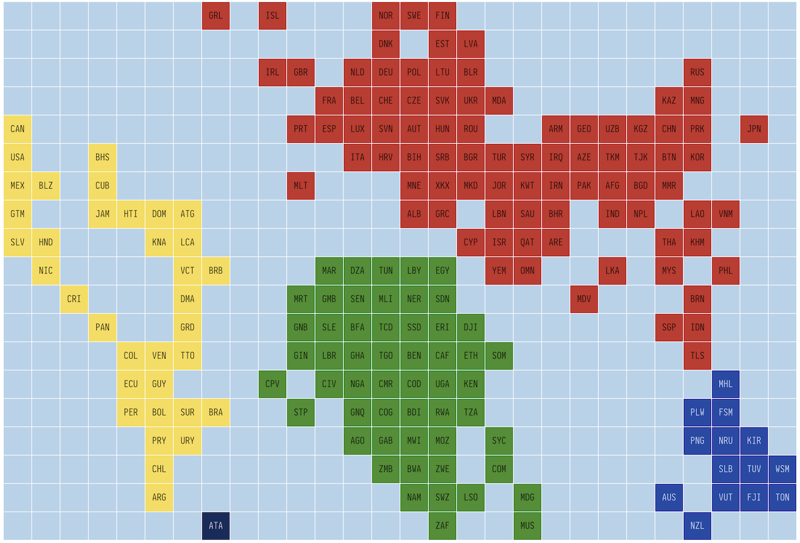

@import "css/litvis.less"

```elm {l=hidden}
import VegaLite exposing (..)
```

# 30 Day Map Challenge, Day 5: Raster

_This document best viewed in [litvis](https://github.com/gicentre/litvis)_

## Initial Thoughts

Vega-Lite is not optimised for raster datasets so I need to come up with an oblique theme under the title 'raster'.

Could create something based on [gridmaps](http://openaccess.city.ac.uk/id/eprint/15167/) where each grid cell can be considered a raster cell. Perhaps a global gridmap. This would also allow it to be used as the basis of an [OD map](http://openaccess.city.ac.uk/id/eprint/537/) in one of the later entries. Leave as a blank gridmap or map some attribute to each country? e.g most common flag colour?

## Data Preparation

1. Gridmap coordinates based on https://github.com/mustafasaifee42/Tile-Grid-Map, which in turn is based on this [world gridmap layout](https://policyviz.com/2017/10/12/the-world-tile-grid-map/) by Jonathan Schwabish.
2. Converted to CSV with [json-csv.com](https://json-csv.com).
3. Edits to gridmap to make more compact: Greenland moved to Europe; Antarctica 3 rows up 7 columns left; and New Zealand 1 row up; 1 row left and all of the Americas down by 5 rows; Estonia and Scandinavia moved 1 row down and 1 column left; Greenland and Iceland one row down.
4. Modal flag colours taken from [this reddit post](https://www.reddit.com/r/dataisbeautiful/comments/85l10h/average_flags_of_the_world_means_modes_and/?st=jezsig8w&sh=71602d49) with addition of the [Antarctic flag](https://en.wikipedia.org/wiki/Flag_of_Antarctica).

Location of generated files:

```elm {l}
path : String -> String
path file =
    "https://gicentre.github.io/data/30dayMapChallenge/" ++ file
```

## Map Design

Ideally I would colour each country by its own modal flag colour, but with limited time, I will use the modal colour of the continental region.
Africa's modal colour is split between red and green, depending on how colours are counted, but for contrast with Europe and Asia, I have opted for the green.

```elm {l v}
rasterWorld : Spec
rasterWorld =
    let
        scaleFactor =
            50

        w =
            28 * scaleFactor

        h =
            19 * scaleFactor

        gridLocations =
            List.range 2 20
                |> List.concatMap (\x -> List.map (\y -> ( x, y )) (List.range 1 28))

        cfg =
            configure
                << configuration (coView [ vicoStroke Nothing ])

        landData =
            dataFromUrl (path "worldGridmap.csv")
                [ parse [ ( "row", foNum ), ( "col", foNum ) ] ]

        seaData =
            dataFromColumns []
                << dataColumn "row" (List.map (Tuple.first >> toFloat) gridLocations |> nums)
                << dataColumn "col" (List.map (Tuple.second >> toFloat) gridLocations |> nums)

        colours =
            categoricalDomainMap
                [ ( "Africa", "rgb(64,143,40)" )
                , ( "Americas", "rgb(247,221,76)" )
                , ( "Antarctica", "rgb(18,43,92)" )
                , ( "Asia", "rgb(200,47,41)" )
                , ( "Europe", "rgb(200,47,41)" )
                , ( "Oceania", "rgb(32,72,169)" )
                ]

        trans =
            transform
                << filter (fiValid "row")

        positionEnc =
            encoding
                << position X [ pName "col", pOrdinal, pAxis [] ]
                << position Y [ pName "row", pOrdinal, pAxis [] ]
                << text [ tName "alpha3" ]

        seaSpec =
            asSpec
                [ seaData []
                , positionEnc []
                , square [ maSize (scaleFactor * scaleFactor), maFill "rgb(147,192,225)", maStroke "white", maStrokeWidth 1 ]
                ]

        landEnc =
            positionEnc
                << color [ mName "region", mScale colours, mLegend [] ]

        landSpec =
            asSpec
                [ landData
                , trans []
                , landEnc []
                , square [ maSize (scaleFactor * scaleFactor), maStroke "white", maStrokeWidth 1, maOpacity 1 ]
                ]

        labelEnc =
            positionEnc
                << color
                    [ mDataCondition
                        [ ( expr "datum.region == 'Antarctica' || datum.region == 'Oceania'", [ mStr "white" ] )
                        ]
                        [ mStr "black" ]
                    ]

        labelSpec =
            asSpec [ landData, trans [], labelEnc [], textMark [ maFontSize (scaleFactor / 3), maFont "iosevka", maOpacity 0.7 ] ]
    in
    toVegaLite
        [ cfg []
        , width w
        , height h
        , layer [ seaSpec, landSpec, labelSpec ]
        ]
```


