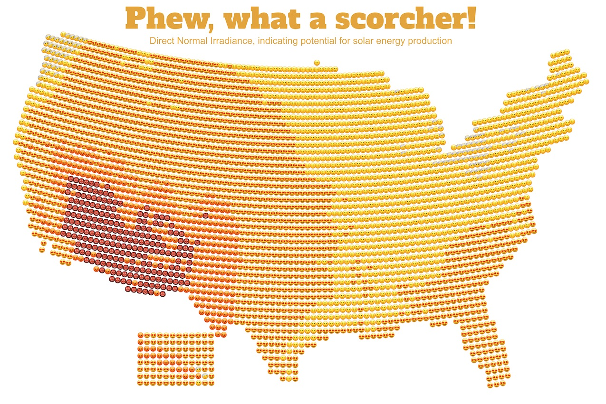

@import "css/litvis.less"

```elm {l=hidden}
import VegaLite exposing (..)
```

# 30 Day Map Challenge, Day 9: Yellow

_This document best viewed in [litvis](https://github.com/gicentre/litvis)_

## Initial Thoughts

A map of the sun. The NASA [SOHO archive](https://sohowww.nascom.nasa.gov/data/archive.html) provides data from a range of solar missions. Or perhaps [solar radiation on earth](https://www.nrel.gov/gis/data-solar.html).

A raster map of solar properties, but represented with emojis selected to create a sequential colour scale.

e.g. 🤕🙂🥰😍🥵😡👹

## Data Preparation

Data are modelled direct normal irradiance values averaged over the years 1998-2016. Indicates the potential for renewable solar energy production across the US.

1. Download [Direct Normal Irradience (DNI)](https://www.nrel.gov/gis/data-solar.html) of the US and sample grid at every 10th cell in X and Y using its `GRIDCODE` referenc; strip unwanted attributes and save as a point file.

```
mapshaper us9809_dni_updated.shp \
 -filter '(""+GRIDCODE).padStart(9,"0").slice(3,4)%5=="0" && (""+GRIDCODE).padStart(9,"0").slice(7,8)%5=="0"' \
 -filter-fields GRIDCODE,ANN_DNI \
 -points \
 -each 'longitude=this.x, latitude=this.y' \
 -o 'solarDNI.csv'
```

Location of generated files:

```elm {l}
path : String -> String
path file =
    "https://gicentre.github.io/data/30dayMapChallenge/" ++ file
```

## Map Design

Project grid with AlbersUSA to produce Hawaii inset.

```elm {l v}
emojiMap : Spec
emojiMap =
    let
        w =
            1200

        h =
            w * 5 / 8

        cfg =
            configure
                << configuration (coView [ vicoStroke Nothing ])

        data =
            dataFromUrl (path "solarDNI.csv") [ parse [ ( "ANN_ONI", foNum ) ] ]

        trans =
            transform
                << filter (fiExpr "slice(datum.GRIDCODE,0,5) != '16055' && slice(datum.GRIDCODE,-4) > '1855'")
                << calculateAs "round(datum.ANN_DNI)" "dni"
                << calculateAs "{3: '\u{1F915}', 4: '🙂', 5: '😍', 6:'😍',7:'😡',8:'👹',9:'👹'}[datum.dni]" "cat"

        proj =
            projection [ prType albersUsa ]

        enc =
            encoding
                << position Longitude [ pName "longitude", pQuant ]
                << position Latitude [ pName "latitude", pQuant ]
                << text [ tName "cat", tNominal ]
    in
    toVegaLite
        [ cfg []
        , width w
        , height h
        , title "Phew, what a scorcher!"
            [ tiFont "Alfa Slab One"
            , tiFontWeight Normal
            , tiFontSize 60
            , tiColor "rgb(238,161,20)"
            , tiOffset -30
            , tiSubtitle "Direct Normal Irradiance, indicating potential for solar energy production"
            , tiSubtitleColor "rgb(238,161,20)"
            , tiSubtitleFontSize 20
            ]
        , data
        , trans []
        , proj
        , enc []
        , textMark [ maFontSize (w / 90) ]
        ]
```


