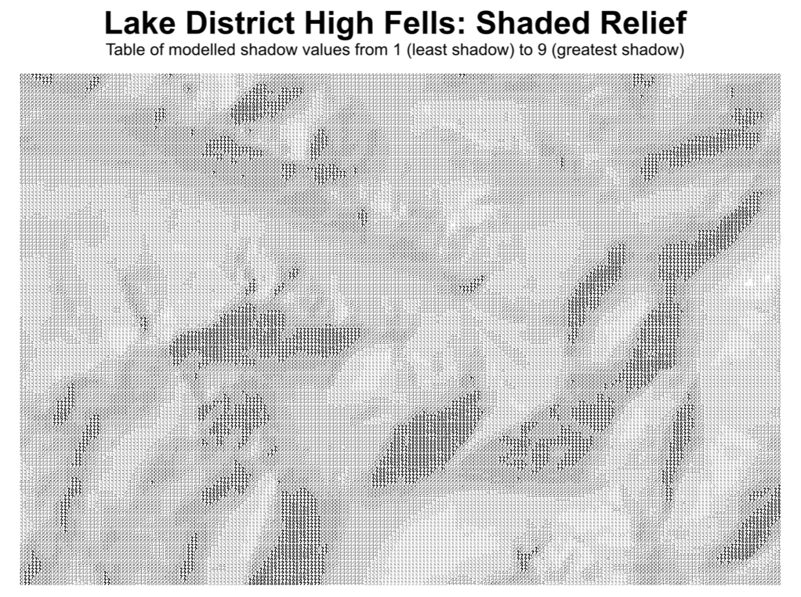
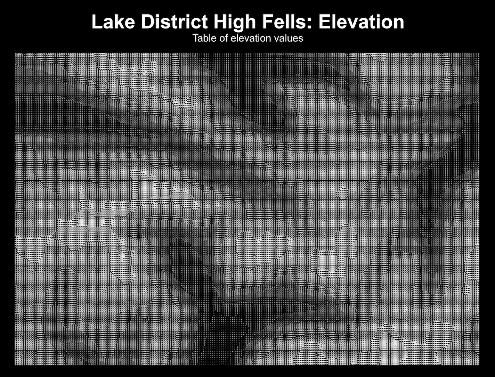
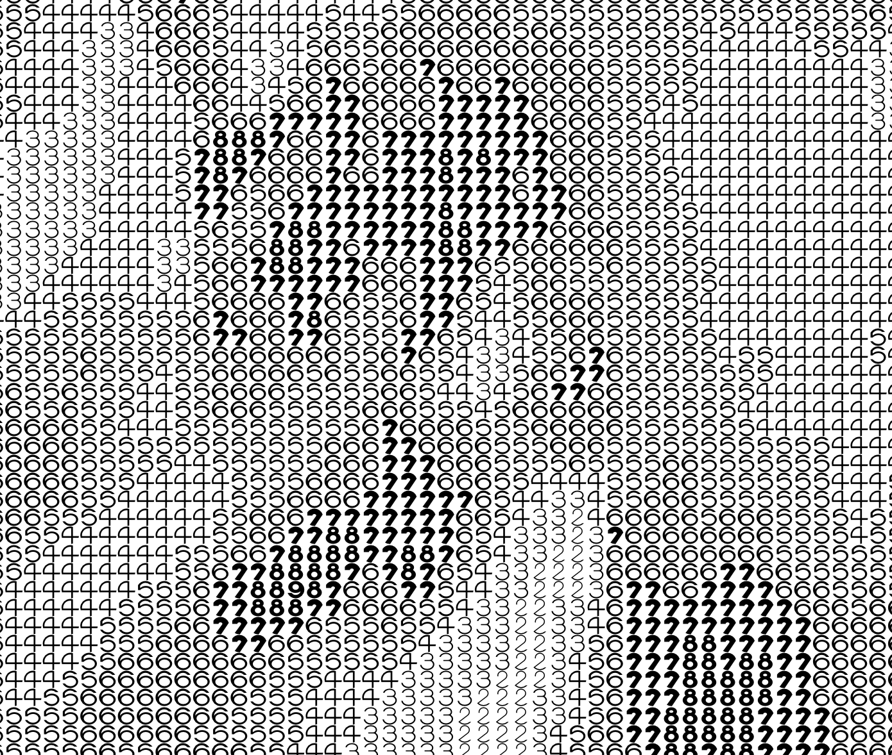
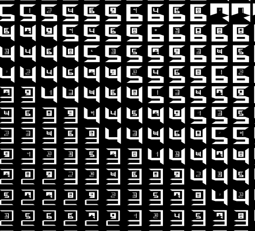

@import "css/litvis.less"

```elm {l=hidden}
import VegaLite exposing (..)
```

# 30 Day Map Challenge, Day 11: Elevation

_This document best viewed in [litvis](https://github.com/gicentre/litvis)_

## Initial Thoughts

I'd like to do something a little different to a common shaded relief map of a DEM (not least because Vega-Lite is not optimised for DEM representation).

This is a chance to explore [FatFonts](http://fatfonts.org) for elevation depiction. Could show either absolute elevation or shaded relief. Relief takes advantage of FatFonts' lightness properties more effectively, but elevation is a more literal interpretation of the subject and more effectively conveys the 'this is both a table and a map' idea.

## Data Preparation

Elevation data taken from Ordnance Survey [Terrain 50](https://www.ordnancesurvey.co.uk/opendatadownload/products.html#TERR50) DEM, converted to point file in [LandSerf](http://www.landserf.org). Shaded relief calculated from the same DEM in LandSerf.

Location of generated files:

```elm {l}
path : String -> String
path file =
    "https://gicentre.github.io/data/30dayMapChallenge/" ++ file
```

## Map Design

Use fat fonts to show absolute elevation. Terrain mapping often shows higher elevations in lighter colours, so show numbers in white against a black background.

### Test surface

```elm {l v}
fontTest : Spec
fontTest =
    let
        w =
            700

        h =
            700

        numColumns =
            31

        cfg =
            configure
                << configuration (coView [ vicoStroke Nothing ])

        gridLocations =
            List.range 1 numColumns
                |> List.concatMap (\x -> List.map (\y -> ( x, y )) (List.range 1 numColumns))

        data =
            dataFromColumns []
                << dataColumn "x" (List.map (Tuple.first >> toFloat) gridLocations |> nums)
                << dataColumn "y" (List.map (Tuple.second >> toFloat) gridLocations |> nums)

        trans =
            transform
                << calculateAs "pad(datum.x*datum.y,3,'0','left')" "elev"

        enc =
            encoding
                << position X [ pName "x", pQuant, pAxis [] ]
                << position Y [ pName "y", pQuant, pAxis [] ]
                << text [ tName "elev", tNominal ]
    in
    toVegaLite
        [ cfg []
        , width w
        , height h
        , data []
        , trans []
        , enc []
        , textMark [ maFont "FatFont7", maFontSize (w / numColumns) ]

        --  , textMark []
        ]
```

### Lake District High Fells

```elm {l v}
elevMap : Spec
elevMap =
    let
        w =
            1400

        h =
            w * 146 / 209

        cfg =
            configure
                << configuration (coView [ vicoStroke Nothing ])

        data =
            dataFromUrl (path "highFellsElevation.csv") []

        trans =
            transform
                << calculateAs "pad(datum.elev,3,'0','left')" "pElev"

        encMap =
            encoding
                << position X [ pName "x", pQuant, pAxis [] ]
                << position Y [ pName "y", pQuant, pAxis [] ]
                << text [ tName "pElev", tNominal ]
    in
    toVegaLite
        [ cfg []
        , width w
        , height h
        , background "black"
        , padding (paSize 50)
        , title "Lake District High Fells: Elevation"
            [ tiColor "white"
            , tiFontSize (w / 25)
            , tiSubtitleColor "White"
            , tiSubtitleFontSize (w / 48)
            , tiSubtitle "Table of elevation values"
            , tiOffset (w / -30)
            ]
        , data
        , trans []
        , encMap []
        , textMark [ maColor "white", maFont "FatFont7", maFontSize (w / 255) ]
        ]
```

```elm {l v}
reliefMap : Spec
reliefMap =
    let
        w =
            1400

        h =
            w * 146 / 209

        cfg =
            configure
                << configuration (coView [ vicoStroke Nothing ])

        data =
            dataFromUrl "data/highFellsElevation.csv" []

        trans =
            transform
                << calculateAs "floor(datum.relief / 10)" "pRelief"

        encMap =
            encoding
                << position X [ pName "x", pQuant, pAxis [] ]
                << position Y [ pName "y", pQuant, pAxis [] ]
                << text [ tName "pRelief", tNominal ]
    in
    toVegaLite
        [ cfg []
        , width w
        , height h
        , padding (paSize 50)
        , title "Lake District High Fells: Shaded Relief"
            [ tiFontSize (w / 25)
            , tiSubtitleFontSize (w / 48)
            , tiSubtitle "Table of modelled shadow values from 1 (least shadow) to 9 (greatest shadow)"
            , tiOffset (w / -30)
            ]
        , data
        , trans []
        , encMap []
        , textMark [ maFont "FatFont-Rotunda", maFontSize (w / 75) ]
        ]
```





