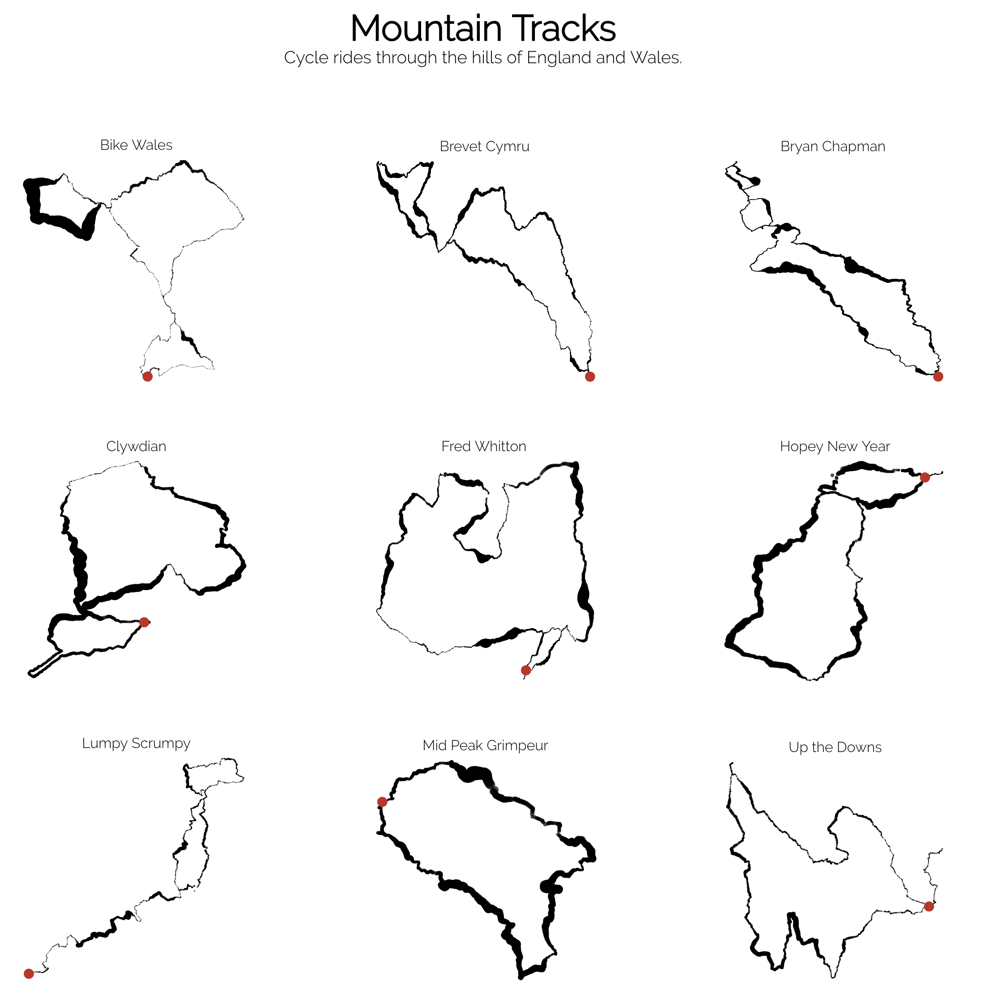

@import "css/litvis.less"

```elm {l=hidden}
import VegaLite exposing (..)
```

# 30 Day Map Challenge, Day 13: Tracks

_This document best viewed in [litvis](https://github.com/gicentre/litvis)_

## Initial Thoughts

When I ride my bike on long rides I attach a GPS to record both my location and elevation. These tracks provide a document of the ride. Could show them using Huffman's [profile mapping technique](https://cartographicperspectives.org/index.php/journal/article/view/cp63-huffman). Can use the [circle sizing method](https://openaccess.city.ac.uk/12351/) to create a calligraphic style for the track representation.

## Data Preparation

Track files need to be in tabular format with columns `x, y, z, ride, start` where `x` and `y` are eastings and northings, `z` is elevation, `ride` is a unique ride name for each track, and `start` is 1 indicating the start location of the ride (which need not be the first point in the GPS track) and 0 for other track points. This was generated by concatenating the output from my GPS and manually adding the ride name and start points.

## Profile Maps

Want to create a simple calligraphic style implying pen and ink, where line thickness is proportional to absolute elevation. Can show multiple rides by faceting by ride name. Adding the start location in red provides a strong contrast and alludes to Chinese calligraphy.

```elm {l}
profileMapFW : Spec
profileMapFW =
    let
        cfg =
            configure
                << configuration (coView [ vicoStroke Nothing ])

        trackData =
            dataFromUrl "data/cycleRides.csv" [ parse [ ( "x", foNum ), ( "y", foNum ), ( "z", foNum ), ( "start", foNum ) ] ]

        trans =
            transform
                << filter (fiExpr "datum.start == 1")

        encPos =
            encoding
                << position X [ pName "x", pQuant, pScale [ scZero False, scNice niFalse ], pAxis [] ]
                << position Y [ pName "y", pQuant, pScale [ scZero False, scNice niFalse ], pAxis [] ]

        encTrack =
            encPos
                << size [ mName "z", mQuant, mScale [ scType scPow, scExponent 3, scRange (raNums [ 1, 400 ]) ], mLegend [] ]

        trackSpec =
            asSpec [ encTrack [], circle [ maColor "black" ] ]

        startSpec =
            asSpec [ trans [], encPos [], circle [ maColor "rgb(198,41,30)", maSize 200, maOpacity 1 ] ]

        profileMapSpec =
            asSpec [ width 300, height 300, layer [ trackSpec, startSpec ] ]

        res =
            resolve
                << resolution (reScale [ ( chX, reIndependent ), ( chY, reIndependent ) ])
    in
    toVegaLite
        [ cfg []
        , title "Mountain Tracks"
            [ tiFont "Raleway"
            , tiFontWeight Bold
            , tiFontSize 50
            , tiAnchor anMiddle
            , tiOffset 100
            , tiSubtitle "Cycle rides through the hills of England and Wales."
            , tiSubtitleFont "Raleway"
            , tiSubtitleFontSize 24
            ]
        , trackData
        , res []
        , columns 3
        , spacingRC 80 180
        , facetFlow [ fName "ride", fNominal, fHeader [ hdTitle "", hdLabelFont "Raleway", hdLabelFontSize 20 ] ]
        , specification profileMapSpec
        ]
```


