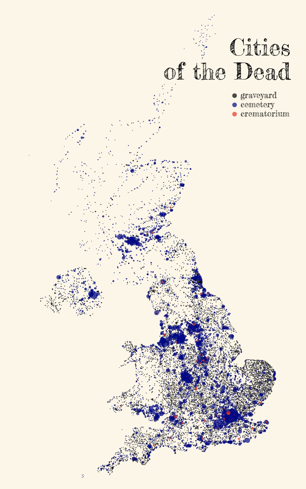

@import "css/litvis.less"

```elm {l=hidden}
import VegaLite exposing (..)
```

# 30 Day Map Challenge, Day 19: Urban

_This document best viewed in [litvis](https://github.com/gicentre/litvis)_

## Initial Thoughts

Would like to ensure that 'urban' is distinct from 'built environment'. Could look at various attempts to quantify and classify 'urban', perhaps emphasising it's fuzzy boundaries. But have limited time, so this might have to wait for another time.

What recorded features most characterise urban areas? Browse [OSM map features](https://wiki.openstreetmap.org/wiki/Map_Features). Would be interesting to map our clustering after death. Cities of the dead?

## Data Preparation

Use overpass to select cemeteries, crematoria, etc. This allows larger areas to be considered without having to download entire OSM dataset for a region.

1. Download all cemeteries, graveyards and crematoria in the UK, via the [Overpass API](https://overpass-turbo.eu).

```
( area[name="United Kingdom"]; )->.a;
way(area.a)[landuse=cemetery];
(._;>;);
out;
```

```
( area[name="United Kingdom"]; )->.a;
way(area.a)[amenity=grave_yard];
(._;>;);
out;
```

```
( area[name="United Kingdom"]; )->.a;
way(area.a)[amenity=crematorium];
(._;>;);
out;
```

2. Convert the overpass OSM (XML) files to geoJSON:

```
ogr2ogr -f GeoJSON ukCemeteries.geojson ukCemeteries.osm multipolygons
ogr2ogr -f GeoJSON ukCrematoria.geojson ukCrematoria.osm multipolygons
ogr2ogr -f GeoJSON ukGraveYards.geojson ukGraveyards.osm multipolygons
```

3. Use mapshaper to convert to point file storing the area of each land parcel:

ukCemeteries.geojson:

```
   each 'longitude=this.centroidX, latitude=this.centroidY, area=this.area'
   filter-fields longitude,latitude,area
   o ukCemeteries.csv
```

ukCrematoria.geojson:

```
   each 'longitude=this.centroidX, latitude=this.centroidY, area=this.area'
   filter-fields longitude,latitude,area
   o ukCrematoria.csv
```

ukGraveyards.geojson:

```
   each 'longitude=this.centroidX, latitude=this.centroidY, area=this.area'
   filter-fields longitude,latitude,area
   o ukGraveyards.csv
```

4. Concatenate all three csv files providing an additional column identifying the type (`cemetery`, `graveyard` and `crematorium`), stored in `ukDead.csv`

Location of generated files:

```elm {l}
path : String -> String
path file =
    "https://gicentre.github.io/data/30dayMapChallenge/" ++ file
```

## Map Design

I would like to plot the actual location of plots rather than normalise by density. The risk is that this simply echoes the (living) population density. But by sizing point symbols by size of the cemetery / graveyard, we get a clearer distinction between urban cemeteries and rural graveyards. We also see some of the larger facilities are "out of town", such as [Brookwood Cemetery](https://en.wikipedia.org/wiki/Brookwood_Cemetery) in Surrey.

```elm {v l}
citiesOfTheDead : Spec
citiesOfTheDead =
    let
        cfg =
            configure
                << configuration (coView [ vicoStroke Nothing ])

        data =
            dataFromUrl (path "ukDead.csv") []

        colours =
            categoricalDomainMap
                [ ( "graveyard", "black" )
                , ( "cemetery", "darkBlue" )
                , ( "crematorium", "red" )
                ]

        enc =
            encoding
                << position Longitude [ pName "longitude", pQuant ]
                << position Latitude [ pName "latitude", pQuant ]
                << color
                    [ mName "type"
                    , mNominal
                    , mScale colours
                    , mLegend
                        [ leTitle ""
                        , leLabelFont "Fredericka the Great"
                        , leLabelFontSize 18
                        , leOrient loNone
                        , leX 470
                        , leY 165
                        ]
                    ]
                << size
                    [ mName "area"
                    , mQuant
                    , mScale [ scRange (raNums [ 2, 500 ]) ]
                    , mLegend []
                    ]
    in
    toVegaLite
        [ width 600
        , height 1000
        , cfg []
        , background "rgb( 252, 246, 229 )"
        , padding (paSize 40)
        , title "Cities\nof the Dead"
            [ tiFont "Fredericka the Great"
            , tiFontSize 50
            , tiFontWeight Normal
            , tiOrient siTop
            , tiAnchor anEnd
            , tiOffset -150
            ]
        , data
        , enc []
        , circle []
        ]
```


